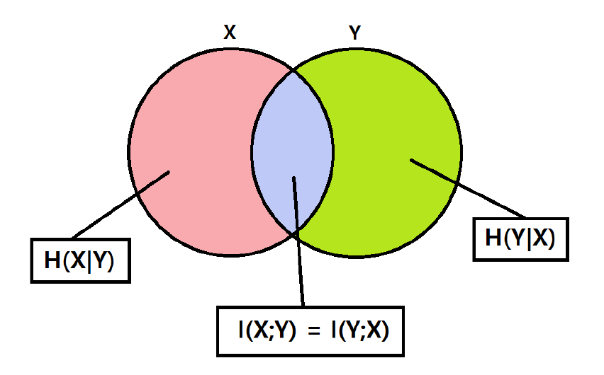

## 2.1 Entropy

long contents .....

1. a
2. b
3. c
4. d

## 2.2 Properties of Entropy

long contents .....

- 1
- 2
- 3
- 4

## 2.3 Cross Entropy Loss

long contents .....

1. e
2. f
3. g
4. h

## 2.4 Jointly Distributed Random Variables

두 개의 확률변수 $X \in \mathcal{X},\ Y \in  \mathcal{Y}$ 를 생각해보자. 이 확률 변수들의 결합 확률 분포(Joint Probability Distribution)의 확률 밀도 함수 (Probability mass function)는 다음과 같이 주어질 것이다.
$$
p_{X, Y}(x, y)= \mathrm{Pr} [X=x, Y=y]
$$
이 결합확률분포의 확률밀도함수 $p_{X,Y}(x,y)$는 $X, Y$가 동시에 특정한 값 $x, y$를 가질 확률을 말한다.

이때 특정한 확률변수 하나에 대해서만 (여기서는, $X$) 그 확률을 고려해볼 수 있는데, 이를 주변 확률 분포(Marginal Probability Distribution)이라 한다. 이 값은 다음과 같이 목표가 되는 확률변수 $X=x$에서 나머지 확률변수에 대한 확률밀도함수값의 가중합으로 구해진다.
$$
p_{X} (x)= \sum_{y\in \mathcal{Y} }^{}{p_{X, Y} (x, y)}
$$
다르게 바라보면, 다음과 같이 가능한 $y \in \mathcal{Y}$ 에 대한 조건부 확률  $p_{X\mid Y}(x\mid Y)$의 기댓값으로도 생각할 수 있고
$$
p_{X} (x) = \sum_{y\in \mathcal{Y} }^{}{p_{X\mid Y} (x\mid y)p_{Y} (y)} = \mathbb{E}[p_{X\mid Y} (x\mid Y)]
$$
이는 $X$에 대한 주변 확률 분포(이하, Marginal)가 조건부 확률의 $Y-$평균으로 간주할 수 있음을 보여준다.

---

이제 결합확률분포를 이루는 두 확률변수 $X, Y$에 각각 임의의 함수$f: X\to \mathbb{R}, g: Y\to \mathbb{R}$ 을 씌웠을 때의 기댓값을 생각해보자.
$$
\begin{align}
\mathbb{E}[f(X)+g(Y)] &= \sum_{x,y}^{}{[f(x)+g(y)]p_{X,Y}(x,y) }  \\
&= \underbrace{ \sum_{x,y}^{}{f(x)p_{X,Y}(x,y) } }_{\text{term1} } + \underbrace{ \sum_{x,y}^{}{g(y)p_{X,Y}(x,y) } }_{\text{term2} }
\end{align}
$$
위 식에서 $\text{term1}$에서 $f$는 확률변수 $X$에만 의존하고, $\text{term2}$에서 $g$는 확률변수 $Y$에만 의존하므로 각 항을 확률변수 $Y, X$에 대한 marginal로 쓸 수 있다.
$$
\begin{align}
\sum_{x,y}^{}{f(x)p_{X,Y}(x,y) }+\sum_{x,y}^{}{g(y)p_{X,Y}(x,y) } &= \sum_{x}^{}{f(x)p_{X} (x)} + \sum_{y}^{}{g(y)} p_{Y} (y) \\
&= \mathbb{E}[f(X)] +\mathbb{E}[g(Y)]
\end{align}
$$
이로써 확률변수 $X, Y$가 결합확률분포를 이룰 때, 각 변수에 대한 함수의 기댓값은 항상, 심지어 $X, Y$가 서로 독립이 아닐 때에도, $\mathbb{E}[f(X) + g(Y)] = \mathbb{E}[f(X)]+\mathbb{E}[g(Y)]$의 선형성을 띰을 알 수 있다.

---

결합확률분포는 또한 다음의 특징을 가진다.
$$
p_{X,Y} (x,y)= p_{X} (x)\cdot p_{Y} (y) \iff X \perp\mkern-10mu\perp  Y
$$
$\impliedby$ 방향은 독립의 정의에 의해 자연스럽게 도출된다. 따라서 $\implies$ 방향을 증명하기 위해, $\phi_{1}: X\to \mathbb{R}, \phi_{2}Y\to\mathbb{R}$인 두 함수 $\phi_{1}, \phi_{2}$에 대해
$$
p_{X, Y} (x, y)= \phi_{1} (x) \cdot\ \phi_{2} (y)
$$
를 만족한다고 가정하자.

$X, Y$ 각각의 marginal을 조건부 확률로 나타내면,
$$
\begin{align}
p_{X} (x) = \sum_{y}^{}{p_{X, Y} (x, y)} = \sum_{y}^{}{\phi_{1} (x)\cdot \phi_{2} (y)} = \phi_{1} (x)\cdot \sum_{y}^{}{\phi_{2} (y)} =  \phi_{1} (x) \cdot C_{Y}  \\
p_{Y} (y) = \sum_{x}^{}{p_{X, Y} (x, y)} = \sum_{x}^{}{\phi_{1} (x)\cdot \phi_{2} (y)} = \phi_{2} (y)\cdot \sum_{x}^{}{\phi_{1} (x)} =  \phi_{2} (y) \cdot C_{X}
\end{align}
$$
이때, 전체 결합확률분포의 정규화 조건 $\sum_{}^{}{p_{X, Y}(x, y)}= 1$에 따라
$$
\sum_{X, Y}^{}{p_{X, Y} (x, y)} = \sum_{x}^{}{}\sum_{y}^{}{} \phi_{1}(x)\cdot \phi_{2} (y) = \left( \sum_{x}^{}{\phi_{1} (x)}  \right) \cdot  \left( \sum_{y}^{}{\phi_{2} (y)}  \right)  = C_{X} \cdot C_{Y} = 1
$$
$$
\therefore p_{X, Y} (x, y)= \cfrac{1}{C_{X} \cdot C_{Y} }\cdot \phi_{1} (x)\cdot \phi_{2} (y) = \cfrac{\phi_{1}(x)}{C_{X} }\cdot \cfrac{\phi_{2} (y)}{C_{Y} } = p_{X} (x)\cdot p_{Y} (y)
$$
$X, Y$가 서로 독립임을 알 수 있다.

### 2.4.1 Joint Entropy

> 결합 엔트로피(Joint Entropy)란?

결합 엔트로피 H(X1,X2)는 두 확률 변수 X1,X2​가 동시에 가질 정보량의 기대값이다.

$$
H(X_1, X_2) = \mathbb{E} \left[ \log \frac{1}{p_{X_1,X_2}(X_1,X_2)} \right] = \sum_{x_1,x_2} p_{X_1,X_2}(x_1,x_2) \log \frac{1}{p_{X_1,X_2}(x_1,x_2)}
$$

Thm. 30(Property of Entropy)

만약 $X_1$과 $X_2$가 독립이면 $H(X_1, X_2) = H(X_1) + H(X_2)$ 이다.

_Proof._

$$
\begin{aligned}
H(X_1,X_2) &= \sum_{x_1,x_2} p_{X_1,X_2}(x_1,x_2) \log \frac{1}{p_{X_1}(x_1)p_{X_2}(x_2)} \\
&= \sum_{x_1,x_2} p_{X_1,X_2}(x_1,x_2) \left( \log \frac{1}{p_{X_1}(x_1)} + \log \frac{1}{p_{X_2}(x_2)} \right) \\
&= \sum_{x_1} p_{X_1}(x_1) \log \frac{1}{p_{X_1}(x_1)} + \sum_{x_2} p_{X_2}(x_2) \log \frac{1}{p_{X_2}(x_2)} \\
&= H(X_1) + H(X_2)
\end{aligned}
$$

$\therefore$ 두 변수가 독립인 경우 두 변수에서 얻는 정보량은 각 변수에서 얻는 정보량의 합으로 계산

만약 X1​과 X2가 강하게 상관되어 있다면, (X1,X2)로부터 얻는 정보량은 X1​으로부터 얻는 정보량과 거의 비슷할 것이다.

---

**Exercise 32**

> 만약 $H(X_1, X_2) = H(X_1) + H(X_2)$이면, 이것이 독립을 의미하는가?

**Exercise 33**

Alice가 $X$를 균등분포로 $\{1, 2, \dots, 8\}$ 중에서 뽑고, Bob이 세 가지 Yes or No 질문을 한다.

1. $X \in \{5, 6, 7, 8\}$ 인가?
2. $X \in \{1, 2, 5, 6\}$ 인가?
3. $X \in \{1, 3, 5, 7\}$ 인가?

$$ Y_i = \begin{cases} 1 & \text{예} \\ 0 & \text{아니오} \end{cases} $$

각 $Y_i$는 베르누이 확률 변수이고, 서로 독립이다.

$$
H(Y_1) = H(Y_2) = H(Y_3) = 1
$$

$$
H(Y_1, Y_2, Y_3) = H(Y_1) + H(Y_2) + H(Y_3) = 3
$$

$$
H(X) = \log_2 8 = 3
$$

$\therefore$ 세 질문으로 \(X\)를 완벽하게 구분할 수 있음.

### 2.4.2 Conditional Entropy

> **Conditonal Entropy란?**

이미 알고 있는 정보가 존재할 때, 추가로 모르는 정보가 주는 정보량이다.

이미 알고 있는 정보 $Y$가 주어졌을 때, $X$에 관한 정보량은 $$H(X|Y)$$와 같이 나타내고 아래와 같이 정의된다.

$$
H(X|Y) = \mathbb{E}\Big[\log \frac{1}{p_{X|Y}(X|Y)}\Big]
= \sum_{x,y} p_{X,Y}(x,y) \log \frac{1}{p_{X|Y}(x|y)}.
$$

위의 경우에서 우리가 기댓값을 계산하고자 하는 함수는 $\log \frac{1}{p_{X|Y}(X|Y)}$이며 $x$ ,$y$의 확률은 joint distribution $p_{X,Y}(X,Y)$로 나타낼 수 있다.

우리는 기대값을 계산하기 위해 변수 $X$와 $Y$를 고려하고 있다. 결합 엔트로피(joint entropy)는 개별 엔트로피의 합이며, 각각의 $y$와 전체 엔트로피에 대한 각각의 기여(contribution)를 고려할 때 명확해진다. 특정 조건 y를 고정하는 경우를 생각해 보면 다음과 같이 나타낼 수 있다.

$$
H(X|Y = y) = \mathbb{E}\Big[ \log \frac{1}{p_{X|Y}(X|Y = y)} \Big]
$$

이제 위 수식에서 $X$만이 유일한 변수이다. 그러므로 위 수식을 다음과 같이 나타낼 수 있다.

$$
= \sum_{x} p_{X|Y}(x|y) \log \frac{1}{p_{X|Y}(x|y)}
$$

만약 우리가 특정 조건 $y$에 대한 모든 가능한 조건부 엔트로피를 합하면, $Y$에 주어진 $X$의 전체 조건부 엔트로피를 다음과 같이 나타낼 수 있다

$$
H(X|Y) = \sum_{y} p_Y(y) H(X|Y = y)
$$

이제 엔트로피 $H(X)$와 $H(Y|X)$를 고려해보자. $H(X)$는 $X$에 대한 정보이고, $H(Y|X)$는 $X$의 정보가 주어졌을 때 $H(X,Y)$에서의 '남은'정보이다. 따라서 우리는 $H(X) + H(Y|X) = H(X,Y)$라고 기대할 수 있고 아래와 같이 증명가능하다.

$$
\mathbb{E}\Big[ \log \frac{1}{p_X(X)} \Big]+ \mathbb{E}\Big[ \log \frac{1}{p_{Y|X}(Y|X)} \Big]= \mathbb{E}\Big[ \log \frac{1}{p_X(X) p_{Y|X}(Y|X)} \Big]
$$

$$
= \mathbb{E}\Big[ \log \frac{1}{p_{X,Y}(X,Y)} \Big]
$$

$$
= H(X,Y).
$$

$p_{Y|X}(Y|X) = \frac{p_{X,Y}(X,Y)}{p_X(X)}$
를 이용하면 위 증명이 성립함을 쉽게 알 수 있다.

**Exercise 35. 위의 추론 게임(guess game)에서 다음을 계산하여라**

1.  $H(Y2|Y1)$
2.  $H(Y4|Y1)$

풀이:

1.  $\mathbb{E}\Big[ \log \frac{1}{p_{Y2|Y1}(Y2|Y1)} \Big]$을 구하면 된다.

이 경우에서는 $Y1$과 $Y2$가 독립이므로 $\mathbb{E}\Big[ \log \frac{1}{p_{Y2}(Y2)} \Big]$를 구하면 된다.

즉, $\sum_{y} p_{Y2}(y) \log \frac{1}{p_{Y2}(y)}$를 계산하면 된다.

답: 1

2.

$p_{}(Y4=0|Y1=0) = 3/4$

$p_{}(Y4=1|Y1=0) = 1/4$

$p_{}(Y4=0|Y1=1) = 1/4$

$p_{}(Y4=1|Y1=1) = 3/4$

를 이용하면 $H(Y4|Y1=0)$은 $3/4\log4/3+1/4\log4$이고

$H(Y4|Y1=1)$은 $3/4\log4/3+1/4\log4$이다.

따라서 $H(Y4|Y1)$은 ($1/2$)($3/4\log4/3+1/4\log4$)+($1/2$) ($3/4\log4/3+1/4\log4$)이다.

이를 $H(Y4)=1$와 비교해보면 더 작은 것을 알 수 있다.

따라서 조건이 존재할 경우 정보가 같거나 줄어든다는 사실을 알 수 있다.

### 2.4.3 Mutual Information

>**상호 정보량(Mutual Information)이란?**

상호 정보량은 엔트로피와 조건부 엔트로피의 차이로 정의된다.

$$
I(X; Y) = H(X) - H(X \mid Y), \quad I(Y; X) = H(Y) - H(Y \mid X)
$$

조건부 엔트로피와 상호 정보량의 관계는 위와 같은 도식으로도 표현 가능하다.
특히 $I(X; X)$의 경우 아래와 같이 계산되며, 결과적으로 $H(X)$와 같다.

$$
\begin{align*}
I(X; X) &= H(X) - H(X \mid X) \\
        &= H(X)
\end{align*}
$$

---

만약 $X$와 $Y$가 서로 **독립**이라면, 위 도식 혹은 정의에 의해  $$I(X; Y) = 0$$임을 보일 수 있다.  
또한, $I(X; Y) = 0$이면 $X$와 $Y$는 독립이다.

상호 정보량은 다음과 같이 **KL divergence**로도 표현된다.

$$
I(X; Y) = D(p_{X,Y} \parallel p_X p_Y)
$$

위 식에서 볼 수 있듯이, 상호 정보량은 두 확률 분포 간의 거리 또는 발산 정도를 의미한다.
$I(X; Y) = 0$이라면, $p_{X,Y} = p_X p_Y$가 되어 $X$와 $Y$는 독립이 된다.

### 2.4.4 Properties of Mutual Information

**정리 36 (데이터 처리 부등식 I)**
**정리.** \(f\)가 결정론적 함수라면,
\[
H(X) \ge H(f(X))
\]
이다.

**증명.**  
\[
H(X, f(X)) = H(X) + H(f(X)\mid X) = H(X)
\]
또한,
\[
H(X, f(X)) = H(f(X)) + H(X\mid f(X)) \ge H(f(X))
\]
따라서 \(H(X) \ge H(f(X))\)이다.  
(\(f\)가 일대일 대응이고 전사이면 역함수가 존재하므로 이 경우에는 \(H(X)=H(f(X))\).)

---

**정리 37 (Mutual information은 대칭적이다)**
**정리.**  
\[
I(X;Y) = I(Y;X)
\]

**증명.**  
\[
\begin{aligned}
I(X;Y) &= H(X) - H(X\mid Y) \\
       &= H(X) - \bigl(H(X,Y) - H(Y)\bigr) \\
       &= H(X) + H(Y) - H(X,Y) \\
       &= I(Y;X)
\end{aligned}
\]

---

**정리 38 (Mutual information은 비음수이다)**  
**정리.**  
\[
I(X;Y) \ge 0
\]

**증명.**  
$$
\begin{aligned}
H(X) - H(X\mid Y)
&= \mathbb{E}\left[\log \frac{1}{p_X(X)}\right] - \mathbb{E}\left[\log \frac{1}{p_{X\mid Y}(X\mid Y)}\right] \\
&= \mathbb{E}\left[\log \frac{p_{X\mid Y}(X\mid Y)}{p_X(X)}\right] \\
&= \mathbb{E}\left[\log \frac{p_{X,Y}(X,Y)}{p_X(X)p_Y(Y)}\right] \\
&= \sum_{x,y} p_{X,Y}(x,y) \log \frac{p_{X,Y}(x,y)}{p_X(x)p_Y(y)} \\
&= D\!\left(p_{X,Y} \,\|\, p_X p_Y\right) \ge 0 
\end{aligned}
$$
따라서 \(I(X;Y) = D(p_{X,Y}\,\|\,p_X p_Y) \ge 0\).  
여기서 \(p_X p_Y\)는 \(X\)와 \(Y\)가 각각의 주변분포 \(p_X, p_Y\)를 가지지만 서로 독립인 \((X,Y)\)에 대한 분포이다.  
또한 부등식 \(H(X) \ge H(X\mid Y)\)는 “조건부를 취하면 (불확실성이) 줄어들거나 유지된다”는 해석을 가질 수 있다.

---

**정리 39 (데이터 처리 부등식 II)**
**정리.** 임의의 함수 \(f: \mathcal{X} \to \mathbb{R}\)에 대해 다음이 성립한다:
\[
I(X;Y) \ge I(f(X);Y)
\]

**증명.**  
\[
\begin{aligned}
I(X;Y) &= H(Y) - H(Y\mid X) \\
       &= H(Y) - H(Y\mid X, f(X)) \\
       &\ge H(Y) - H(Y\mid f(X)) \\
       &= I(f(X);Y)
\end{aligned}
\]

**일반화.**  
\(X - Y - Z\)가 마르코프 체인(또는 \(X\)와 \(Z\)가 \(Y\)를 조건으로 주었을 때 조건부 독립)일 때, 다음이 서로 동치이다:
1. \(X - Y - Z \iff X\)와 \(Z\)가 \(Y\)를 주었을 때 독립이다. \((X \perp Z \mid Y)\)  
2. \(Y\)가 알려져 있을 때 \(X\)는 \(Z\)를 추정하는 데 쓸모없다.  
3. 모든 \(x,y,z\)에 대해 \(p_{Z\mid X,Y}(z\mid x,y) = p_{Z\mid Y}(z\mid y)\).  

---

**정리 40 (데이터 처리 부등식 III)** 
**정리.**  
만약 \(X - Y - Z\)가 마르코프 체인을 이룬다면,
\[
I(X;Z) \le I(Y;Z)
\]
또는 대칭적으로 \(I(Z;X) \le I(Z;Y)\).

**증명.**  
\[
\begin{aligned}
I(Y;Z) &= H(Z) - H(Z\mid Y) \\
       &= H(Z) - H(Z\mid X, Y) \\
       &\ge H(Z) - H(Z\mid X) \\
       &= I(X;Z)
\end{aligned}
\]
따라서 \(I(Y;Z) \ge I(X;Z)\), 즉 \(I(Z;Y) \ge I(Z;X)\)이다.

**문제 29.(b)**

\(X, Y, Z\)가 결합 확률 분포를 가지는 임의의 확률 변수일 때, 다음 부등식을 증명하고 등호 성립 조건을 찾아라.  
**(b)** \(I(X, Y; Z) \ge I(X; Z)\).

**풀이**

**1. 체인 룰(chain rule) 적용**
상호 정보의 체인 룰에 따르면:
\[
I(X, Y; Z) = I(X; Z) + I(Y; Z \mid X).
\]
이는 “\(X, Y\)가 합쳐질 때 \(Z\)와 주고받는 정보량”을  
먼저 \(X\)가 주는 정보량과, \(X\)를 알고 난 뒤 \(Y\)가 더 주는 추가 정보량으로 분해한 식이다.

**2. 조건부 상호 정보의 비음성**
항상  
\[
I(Y; Z \mid X) \ge 0
\]
이다. (KL 발산 형태로 증명할 수 있다.)

**3. 부등식 결론**
따라서
\[
I(X, Y; Z) = I(X; Z) + I(Y; Z \mid X) \ge I(X; Z).
\]

**4. 등호 성립 조건**
등호 \(I(X, Y; Z) = I(X; Z)\)가 되려면  
\[
I(Y; Z \mid X) = 0 \iff Y \perp Z \mid X
\]
이어야 한다.  
즉 “\(X\)를 조건으로 두었을 때 \(Y\)와 \(Z\)가 독립”이어야 한다.  
이 역시 \(Y \to X \to Z\) 형태의 마르코프 사슬과 동치이다.

---

**문제 31.**
임의의 결정론적 함수 \(g\)에 대하여,
\[
H(X \mid g(Y)) = H(X \mid Y)
\]
이 성립하려면 어떤 조건이 필요한가?

**풀이**

**1. 데이터 처리 부등식 I (조건부 형태)**  
이미 알고 있는 바:
\[
H(X \mid g(Y)) \ge H(X \mid Y),
\]
왜냐하면 “\(Y\)를 알면 \(g(Y)\)를 알 수 있지만, \(g(Y)\)를 안다고 해서 항상 \(Y\)가 복원되지는 않으므로” 불확실성이 더 작아지거나 같기 때문이다.

**2. 등호 조건 분석**
\[
H(X \mid g(Y)) = H(X \mid Y)
\]
일 때, 양쪽 사이에 끼어 있는
\[
H(X \mid Y) - H(X \mid g(Y)) = I(X;Y \mid g(Y)) = 0
\]
이다.  
즉, “\(g(Y)\)를 조건으로 \(X\)와 \(Y\)가 독립”이어야 한다.

**3. 마르코프 사슬 해석**
\[
I(X;Y \mid g(Y)) = 0 \iff X \perp Y \mid g(Y).
\]
이는 바로  
\[
X \longrightarrow g(Y) \longrightarrow Y
\]
꼴의 마르코프 사슬 형태가 성립함을 뜻한다.

**4. 특수 사례**
- \(g\)가 일대일 대응(가역)이면 당연히 \(g(Y) \leftrightarrow Y\) 양방향 복원이 가능하므로 등호 성립.  
- 또 \(X\)와 \(Y\)가 본래 독립이라도  
  \[
  H(X \mid g(Y)) = H(X) = H(X \mid Y)
  \]
  이므로 등호가 된다.  
  이 두 경우는 포함되지만, 유일한 경우는 아니다.

---

**문제 42.(b)**

다음 부등식들 중 일반적으로 \( \ge, =, \le \) 중 어느 관계가 성립하는지 각각 표시하라.  
**(b)** \(I(g(X); Y)\) vs. \(I(X; Y)\).

**풀이**

**1. 데이터 처리 부등식 II**
이것은 4.4절에서 나온 정리와 같다. 임의의 결정론적 함수 \(g\)에 대하여:
\[
I(g(X); Y) \le I(X; Y).
\]

**2. 직관**
- \(X\)가 \(Y\)에 갖는 정보량이 \(I(X;Y)\)이고,  
- \(X\)를 \(g\)로 가공한 \(g(X)\)는 \(X\)보다 “덜 상세”(또는 같음) →  
- \(g(X)\)가 \(Y\)에 제공할 수 있는 정보도 당연히 \(I(X;Y)\) 이하여야 한다.

**3. 형식적 증명**
\[
\begin{aligned}
I(g(X); Y) &= H(Y) - H(Y \mid g(X)) \\
           &\le H(Y) - H(Y \mid X) \quad (\text{조건부 엔트로피 감소 } H(Y \mid g(X)) \ge H(Y \mid X)) \\
           &= I(X; Y).
\end{aligned}
\]

**4. 등호 성립 조건**
등호가 되려면  
\[
H(Y \mid g(X)) = H(Y \mid X) \iff I(Y; X \mid g(X)) = 0 \iff Y \perp X \mid g(X).
\]
즉 “\(g(X)\)를 조건으로 \(X\)와 \(Y\)가 독립”일 때 등호가 된다.  
다시 말해 \(g(X)\)를 기준으로 \(X\)와 \(Y\)는 더 이상의 상호 정보(조건부)가 없다.

### 2.4.5 Conditional Mutual Information

> **조건부 상호정보량이란?**

조건부 상호정보량은 변수 $Y$가 주어졌을 때, $X$와 $Z$ 사이의 상호정보량을 의미한다.

$$
I(X; Z \mid Y) = H(X \mid Y) - H(X \mid Y, Z)
$$

또는 다음과 같이도 표현된다.

$$
I(X; Z \mid Y) = H(Z \mid Y) - H(Z \mid Y, X)
$$

이는 $Z$를 알면 $X$의 불확실성이 얼마나 줄어드는지를 나타낸다.

---

> **조건부 상호정보량이 0이 되는 조건**

조건부 상호정보량이 0이 되려면, $X$와 $Z$가 $Y$가 주어졌을 때 조건부 독립이어야 한다.

$$
P(X, Z \mid Y) = P(X \mid Y) \cdot P(Z \mid Y)
$$

이는 마코프 체인 구조인 $X \rightarrow Y \rightarrow Z$와 동일하다.

---

> [!warning]
> 조건부 상호정보량 $I(X; Z \mid Y)$ 와 일반 상호정보량 $I(X; Z)$는 일반적으로 관계가 없다.

예시 1: 조건부 상호정보량이 일반 상호정보량보다 클 수 있다.

$$
I(X; Z \mid Y) > I(X; Z)
$$

- $X \in \{0, 1\}$, $Z \in \{0, 1\}$
- 각 확률은 다음과 같다:

$$
P(X = 0) = P(X = 1) = \frac{1}{2}, \quad P(Z = 0) = P(Z = 1) = \frac{1}{2}
$$

- $Y = X \oplus Z$ (XOR 연산)

이 경우 다음이 성립한다:

$$
I(X; Z) = 0, \quad I(X; Z \mid Y) = 1
$$

즉, 조건 없이 보면 $X$와 $Z$는 독립이지만, $Y$를 알면 종속이 된다.

---

예시 2: 일반 상호정보량은 존재하지만 조건부 상호정보량은 0인 경우

$$
I(X; Z) > 0, \quad I(X; Z \mid Y) = 0
$$

이는 마코프 체인 $X \rightarrow Y \rightarrow Z$ 구조에서 발생한다.

---

> **여러 변수에 대한 상호정보량**

두 변수 $X, Y$ 와 $Z$ 사이의 상호정보량은 다음과 같이 체인 룰로 나눌 수 있다.

$$
I(X, Y; Z) = I(X; Z) + I(Y; Z \mid X)
$$

---

> **상호정보량의 체인 분해**

여러 변수 $X_1, X_2, \dots, X_n$ 과 $Y$ 간의 상호정보량은 다음과 같이 분해된다.

$$
I(X_1, X_2, \dots, X_n; Y) = I(X_1; Y) + I(X_2; Y \mid X_1) + I(X_3; Y \mid X_1, X_2) + \dots
$$

또는 일반화하여 다음과 같이 표현된다:

$$
I(X_n; Y) = \sum_{i=1}^{n} I(X_i; Y \mid X_1, \dots, X_{i-1})
$$

## 2.5 Random Process

> **확률 과정(Random Process)이란?**

확률 과정은 다음과 같이 정의됩니다:

$$
X = \{X_n\}_{n=1}^{\infty}
$$

이것은 순서를 가진 확률 변수들의 집합이며, 각 $X_n$은 특정 확률 분포를 따릅니다.

- 여기서 $n$은 꼭 시간(time)을 의미하지 않아도 됩니다.
- 예시:
  - 텍스트: $X_1$은 첫 번째 문자, $X_2$는 두 번째 문자 등
  - 이미지: $X_{i,j}$는 $i$행 $j$열 픽셀의 밝기
  - 시계열: $X_t$는 $t$초 후의 값

**핵심**: 인덱스가 시간일 필요는 없으며, **순서만 있으면 확률 과정**이 됩니다.

---

**i.i.d. 과정이란?**

i.i.d.는 independent and identically distributed의 약자입니다.

- **독립(independent)**: 각 $X_n$이 서로 영향을 주지 않음
- **동일 분포(identically distributed)**: 모든 $X_n$이 동일한 확률 분포를 따름

전체 확률은 다음처럼 단순 곱으로 계산할 수 있습니다:

$$
P(X_1 = x_1, \dots, X_n = x_n) = \prod_{i=1}^{n} P(X_i = x_i)
$$

---

> **현실은 대부분 i.i.d.가 아님**
> 예: 텍스트
>
> - "progra_ing"이라는 단어에서 빈칸에 'm'이 올 가능성이 높다고 판단할 수 있음
> - 이는 앞뒤 문맥이 영향을 주기 때문 → 요소들 간에 **의존성 존재**
>
> $\therefore$ 현실의 데이터는 보통 독립적이지 않고, 앞뒤 요소에 영향을 받습니다.

i.i.d.가 아닌 경우 사용하는 모델들:

- 마르코프 모델 (Markov Model)
- 순환 신경망 (Recurrent Neural Network, RNN)
- 트랜스포머 (Transformer)

### 2.5.1 What is Markovian?

i.i.d. ←────────────|────────────→ Practical
**1st-order Markov**

**1차 마르코프 체인(first-order Markov chain)의 개념은, i.i.d. 가정과 실제 현실에서의 데이터 구조 사이를 연결해주는 중간 다리 역할을 합니다.**
"마르코프(Markov)"라는 말은 **1차 상관성(first-order correlation)**이 있다는 의미입니다.
즉, 현재 상태는 **직전 상태에만 의존**하고, 그 이전의 상태에는 의존하지 않는다는 것입니다.

---

**예제 41: 랜덤 워크(Random Walk)**

확률 과정 $X = \{X_n\}$를 다음과 같이 정의합니다:

초기 상태:

$$
X_0 = 0
$$

이후 각 $n$에 대해:

$$
X_n =
\begin{cases}
X_{n-1} + 1 & \text{with probability } \frac{1}{2} \\
X_{n-1} - 1 & \text{with probability } \frac{1}{2}
\end{cases}
$$

즉, 현재 위치에서 매 스텝마다 동전 던지기로 1만큼 앞 또는 뒤로 이동하는 무작위 행보입니다.

예를 들어 다음과 같은 정보가 주어졌다고 해 봅시다:

$$
X_{101} = 51
$$

이때 $X_{102}$는 다음 두 가지 중 하나입니다:

- $X_{102} = 50$
- $X_{102} = 52$

추가로 $X_{100} = 50$이라는 정보를 안다고 해도,
$X_{102}$가 어떻게 될지를 예측하는 데 **아무런 도움이 되지 않습니다.**

이것은 **1차 마르코프 체인의 특성**과 정확히 일치합니다:

> **미래 상태는 현재 상태에만 의존하며, 과거는 무시됩니다.**

---

**핵심 요약**

| 구분           | 설명                                                             |
| -------------- | ---------------------------------------------------------------- |
| i.i.d.         | 각 값이 서로 독립이고 동일한 분포를 가짐                         |
| 1차 마르코프   | 현재 상태는 바로 직전 상태에만 의존함                            |
| 현실 데이터    | 대부분 i.i.d.는 아니며, 1차 마르코프 모델이 더 현실적            |
| 랜덤 워크 예시 | $X_{n}$은 $X_{n-1}$만으로 결정되며, $X_{n-2}$는 영향을 주지 않음 |

---

**요약 구조**

i.i.d. ←────────────|────────────→ 현실 데이터
          ↑
        1st-order Markov
   (현재 상태는 직전 상태에만 의존)

### 2.5.2 1st Order Markov Process

### 2.5.3 kth Order Markov Process

확률 과정 X에 대해,
$$
P_{X_i | X^{i-1}}(x_i \mid x^{i-1}) = P_{X_i | X_{i-k}^{i-1}}(x_i \mid x_{i-k}^{i-1}),
$$
이 성립하는 시퀀스는 **k차 마르코프 과정(kth Order Markov Process)**를 따릅니다.

즉, k차 마르코프 과정을 따르는 시퀀스에 대해서
$$
P_{X^n}(x^n) = \prod_{i=1}^{n} P_{X_i \mid X_{i-k}^{i-1}}(x_i \mid x_{i-k}^{i-1})
$$
이 성립합니다.

### 2.5.4 Stationary Distribution

### 2.5.5 Stationary Markov Process

## 2.6 Continuous Random Variables

### 2.6.1 Probability Density Function

### 2.6.2 Gaussian

### 2.6.3 Differential Entropy

### 2.6.4 Properties of Differential Entropy

### 2.6.5 Joint Differential Entropy

### 2.6.6 Maximum Differential Entropy
